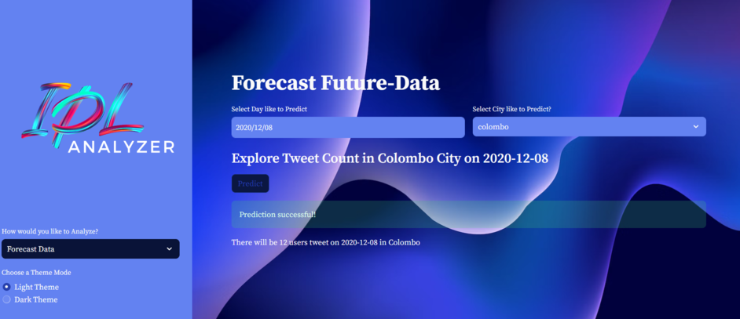
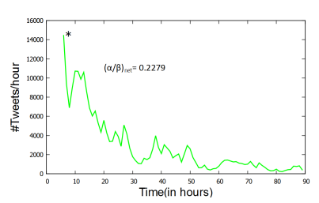

<h1 align="center">
  <br>
   Twitter Hashtags Analysis & Forecasting Project
  <br>
</h1>

<h4 align="center">This project aims to analyze Twitter hashtags data to understand user engagement trends over time and across different cities. It includes functionalities for analyzing past macro-data, forecasting future data, and analyzing past micro-data. The project utilizes FastAPI for the backend and Streamlit for the frontend.</h4>
  
<p align="center">
  <a href="https://"></a>
  <a href="https://"></a>
  <br>
</p>


# Description

## Purpose

The purpose of this project is to provide insights into Twitter user engagement patterns based on hashtags. By analyzing past data, forecasting future trends, and exploring micro-level details, users can gain valuable insights for various purposes such as marketing strategies, content creation, and understanding user behavior.

## Key Features

- Analyzing past macro-data:
  - Generate bubble maps to visualize tweet counts across different cities over time.
  - Generate city-wise bar charts and line charts to analyze tweet counts trends.

- Forecasting future data:
  - Predict tweet counts for future dates and cities using trained machine learning models.

- Analyzing past micro-data:
  - Explore detailed tweet data by filtering based on date, city, and keywords.
  - Export filtered data to CSV for further analysis.

## How to Run the Project

1. Clone the repository to your local machine:
   ```bash
   git clone https://github.com/your-username/twitter-hashtags-analysis.git

2. Install the required dependencies:
   ```bash
   pip install -r requirements.txt
3. Run the backend server:
   ```bash
   uvicorn backend:app --reload --port 8000
4. Run the frontend application after changing the directory to ./frontend:
   ```bash
   streamlit run ui.py






